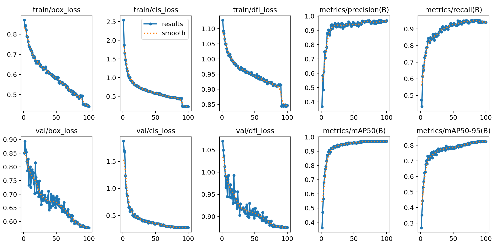
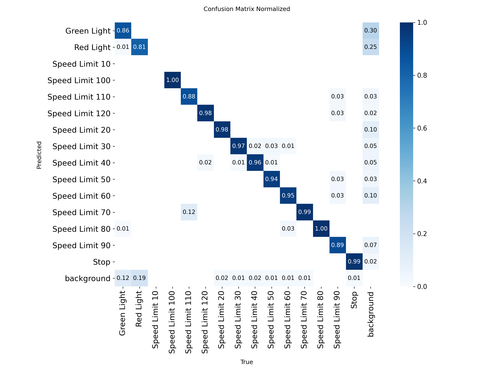
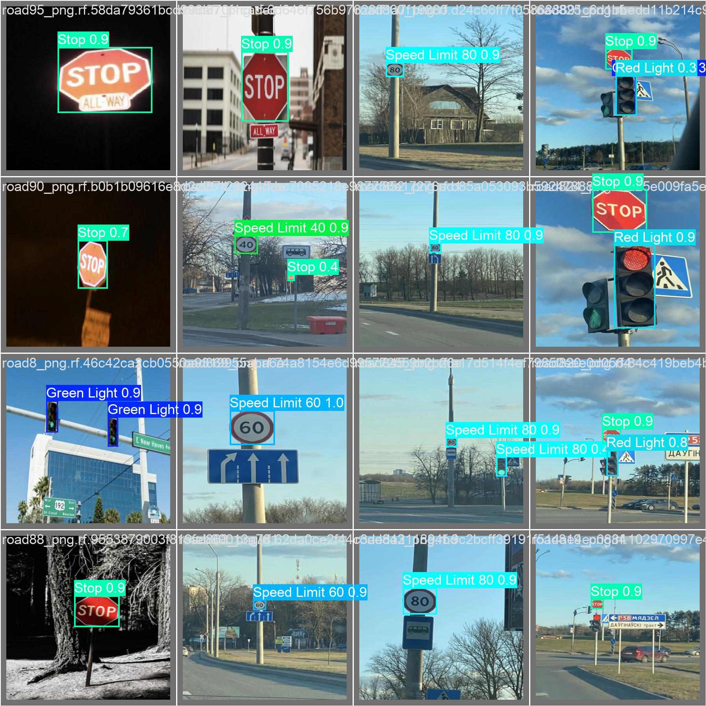
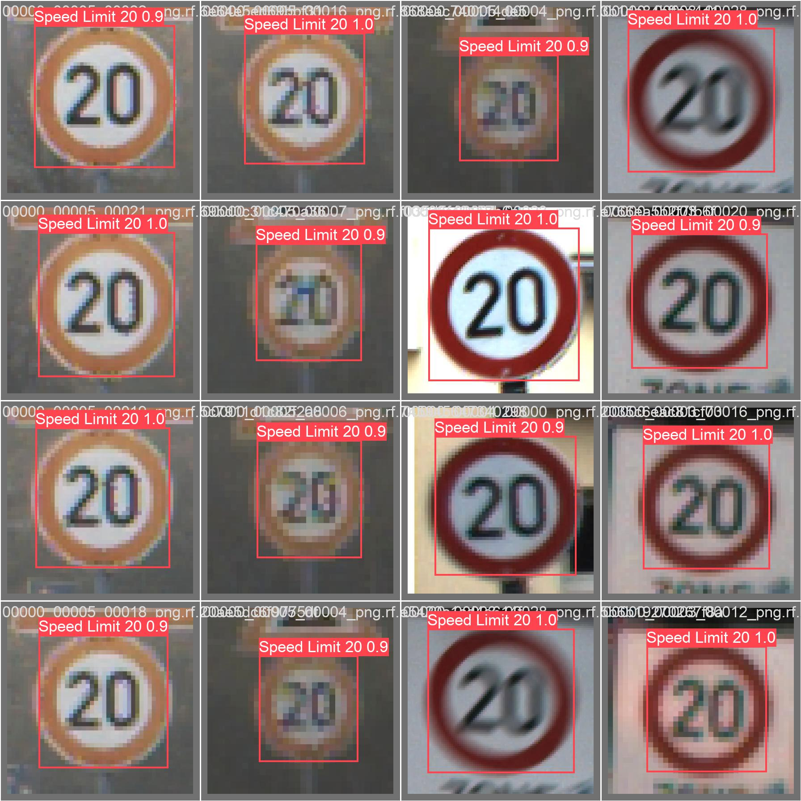

# 交通标志检测实验报告

**姓名：** 冀苏雨 
**学号：**  112304260113

## 1. 实验目标
本实验使用 YOLO 模型完成交通标志目标检测任务，并对模型训练过程和检测结果进行分析。

---

## 2. 实验环境
- 操作系统：Windows
- Python 版本：3.13.5
- PyTorch 版本：2.11.0+cu128
- Ultralytics 版本：8.4.47
- 硬件环境：NVIDIA GeForce RTX 4060 Laptop GPU（8GB 显存）

---

## 3. 模型与训练设置
### 3.1 模型选择
本实验使用的模型为：
- 模型名称：`YOLOv8m`
- 选择原因：
  1. `YOLOv8n` 虽然速度更快，但在本数据集上的检测上限偏低，难以冲击更高分数。
  2. `YOLOv8m` 在精度和显存占用之间平衡较好，能够在 RTX 4060 Laptop GPU 上稳定训练。
  3. 实际实验中，`YOLOv8m` 的验证集效果优于后续尝试的 `YOLOv8l` 和 `YOLO11m`，因此被确定为主方案。

### 3.2 训练参数
- 训练轮数（epochs）：100

- 图像尺寸（imgsz）：416

- batch size：16

- 优化器：Ultralytics `optimizer=auto`，实际自动选择为 `AdamW`

- 初始学习率：自动策略下约为 `0.000526`

- 学习率策略：余弦退火（`cos_lr=True`）

- 是否使用数据增强：是

  本实验中使用了常规数据增强，包括：

  - 水平翻转
  - HSV 色彩扰动
  - 轻微平移、缩放、旋转、剪切
  - Mosaic
  - 少量 MixUp
  - Erasing

### 3.3 训练命令
```bash
python scripts/train_competition.py --model D:\ts_comp\yolov8m_clean.pt --data D:\ts_comp\data.yaml --epochs 100 --imgsz 416 --batch 16 --device 0 --workers 0 --cache False --project D:\ts_comp\runs\traffic_sign_full --name yolov8m_full_416
```

---

## 4. 训练过程分析

### 4.1 损失曲线
在此插入训练损失图（如 `box_loss`、`cls_loss`、`dfl_loss` 等）。



请结合图像回答以下问题：
1. `box_loss`、`cls_loss` 和 `dfl_loss` 总体都呈下降趋势，说明模型在训练过程中不断收敛。
2. 前期下降最快，尤其是前 20 到 30 个 epoch，模型快速学到了目标位置与类别信息。
3. 中后期下降速度明显减缓，说明模型逐渐进入稳定收敛阶段。
4. 后期虽然有轻微波动，但没有出现明显发散；结合验证集指标看，也没有特别严重的过拟合现象。

### 4.2 评价指标变化
在此插入 `Precision`、`Recall`、`mAP50`、`mAP50-95` 等曲线图。


1. 根据训练日志统计，主方案最佳结果为：

   - 最佳 epoch：79
   - Precision：0.95099
   - Recall：0.95171
   - mAP@0.5：0.97084
   - mAP@0.5:0.95：0.81699

   简要分析如下：

   1. 提升最明显的指标是 `mAP@0.5`，说明模型在 IoU=0.5 条件下的检测能力较强。
   2. 最终模型效果较好，Precision 与 Recall 都接近 0.95，说明误检和漏检都控制得比较平衡。
   3. 到后期指标已经基本稳定，模型总体已经收敛。

---

## 5. 混淆矩阵分析

在此插入混淆矩阵图。



重点分析如下：

1. `Stop`、部分限速标志以及交通灯类别整体识别效果较好，主对角线较明显。
2. 容易混淆的类别主要集中在外观相近的限速标志之间，例如 `Speed Limit 60`、`70`、`80`、`90` 等类别，因为它们在形状上非常相似，主要区别是内部数字。
3. 类别混淆的主要原因包括：
   - 部分目标尺寸较小，数字区域分辨率不足；
   - 图像中目标距离较远；
   - 类别之间外观高度相似；
   - 个别稀有类别样本数较少。
4. 从混淆矩阵可以看出，模型对大部分类别已经具备较强判别能力，但在“细粒度限速数字区分”上仍有提升空间。

## 6. 检测结果分析

在此插入若干预测结果图（建议 2 到 4 张）。




1. 分析如下：
   1. 对于尺寸较大、边界清晰、无遮挡较少的交通标志，模型检测较准确，框的位置和类别都比较稳定。
   2. 部分远距离小目标仍存在漏检现象；此外，一些相邻或外观近似的限速标志可能出现误检或分类偏差。
   3. 误检和漏检的原因主要包括：
      - 小目标在 416 分辨率下特征较弱；
      - 某些类别样本数量不均衡；
      - 限速类目标之间视觉差异很小；
      - 复杂背景或光照变化会影响判断。
   4. 对小目标、远距离目标的检测效果虽然已经较好，但仍低于大目标与近距离目标，这也是本数据集的主要难点。


---

## 7. 提交成绩
- 本地验证结果：主方案验证集最佳 `mAP@0.5 = 0.97084`
- 比赛网站提交分数：`0.958335`
- 当前排行榜名次：7

简要说明：
1. 本地验证结果与提交分数不完全一致。本地在公开验证集上达到 `0.97084`，而比赛网站测试集得分为 `0.958335`。
2. 二者不一致是正常现象，可能原因包括：
   - 比赛测试集分布与本地验证集存在差异；
   - 测试集包含更多难样本或小目标；
   - 本地调参过程中对验证集存在一定适配；
   - 提交时采用 TTA、不同阈值或训练轮次，也会带来轻微波动。

---

## 8. 实验总结
1. 本次实验中，`YOLOv8m` 在交通标志检测任务上取得了较好的效果，说明中等规模检测模型配合合适的数据增强和训练策略，能够在该数据集上达到较高精度。模型的主要优点是收敛稳定、Precision 和 Recall 较均衡、对大多数常见交通标志的识别效果较好。

   当前模型最明显的问题主要体现在细粒度限速类别之间的混淆，以及对小目标、远距离目标的检测仍有提升空间。如果继续改进，我会优先尝试以下方向：

   1. 增加多随机种子训练并进行更稳定的模型集成；
   2. 进一步优化小目标检测策略；
   3. 在保证显存可承受的前提下尝试更合理的多尺度推理；
   4. 结合伪标签或更精细的后处理方法继续提升排行榜成绩。
